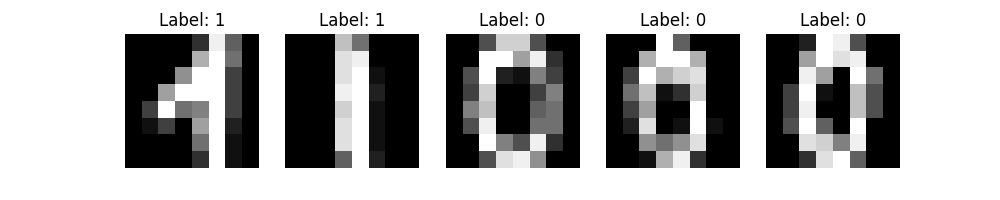
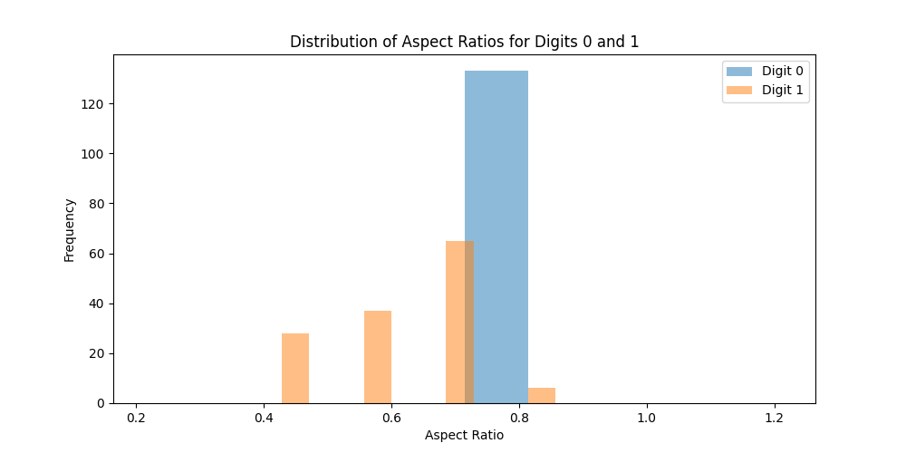
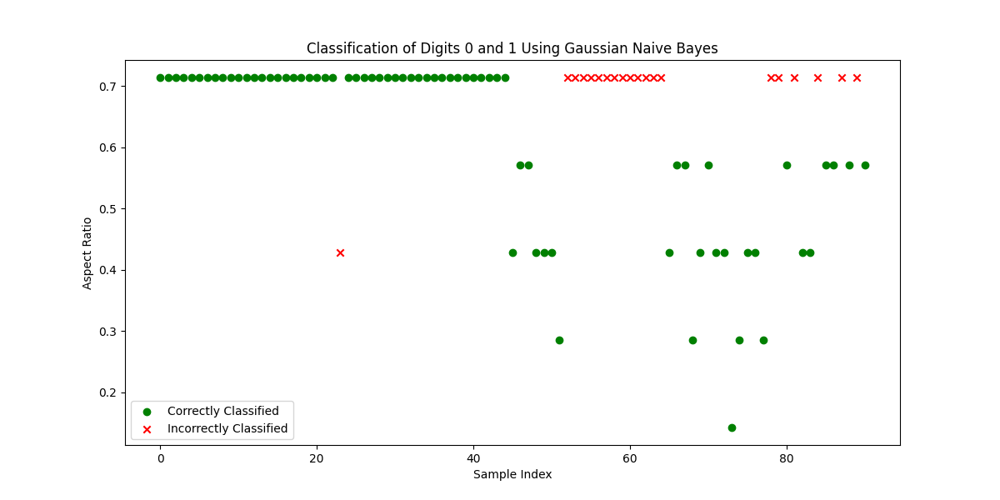

# Digit Classifier

>  A simple Naive Bayesian classifier that works with 0s and 1s taken from the sklearn “load\_digits” dataset, and classifies them based on their aspect ratio for experimental purposes.

  

## Installation:

To run the digit classifier you need to install the given requirements using Python3:

  

```sh
pip install -r requirements.txt
```

or

```sh
pip3 install -r requirements.txt
```

or

```sh
python3 -m pip install -r requirements.txt
```

  

## Goal:

 We tried to solve this simple classification problem with a naive Bayesian classifier using a manual mathematic implementation and the scikit learn library implementation and compared them.


  

  

## Output:

```plaintext
Aspect ratio of a digit 0: 0.7142857142857143
Aspect ratio of a digit 1: 0.5714285714285714

Average Aspect Ratio for Digit 0: 0.7142857142857143
Average Aspect Ratio for Digit 1: 0.6228991596638656

Prior Probability for Label 0: 0.4944237918215613
Prior Probability for Label 1: 0.5055762081784386

------------ Manual Implementation ------------

Misclassified images: 1 (D0) + 19 (D1) = 20

Error percentage: 21.98%
Accuracy: 78.02%

------------ GaussianNB Implementation ------------

Misclassified images: 1 (D0) + 19 (D1) = 20

Error percentage: 21.98%
Accuracy: 78.02%
```

  

## Results

 Both implementations present the exact same results.

 The classification is about 80% accurate, as expected because of the overlap of the aspect ratio of 1s and 0s. The problem is mainly the 1s that fall into the 0s aspect ratio domain, as shown in these plots:




  

A Naive Bayesian classifier would need more features, instead of only relying to aspect ratio to solve this problem.